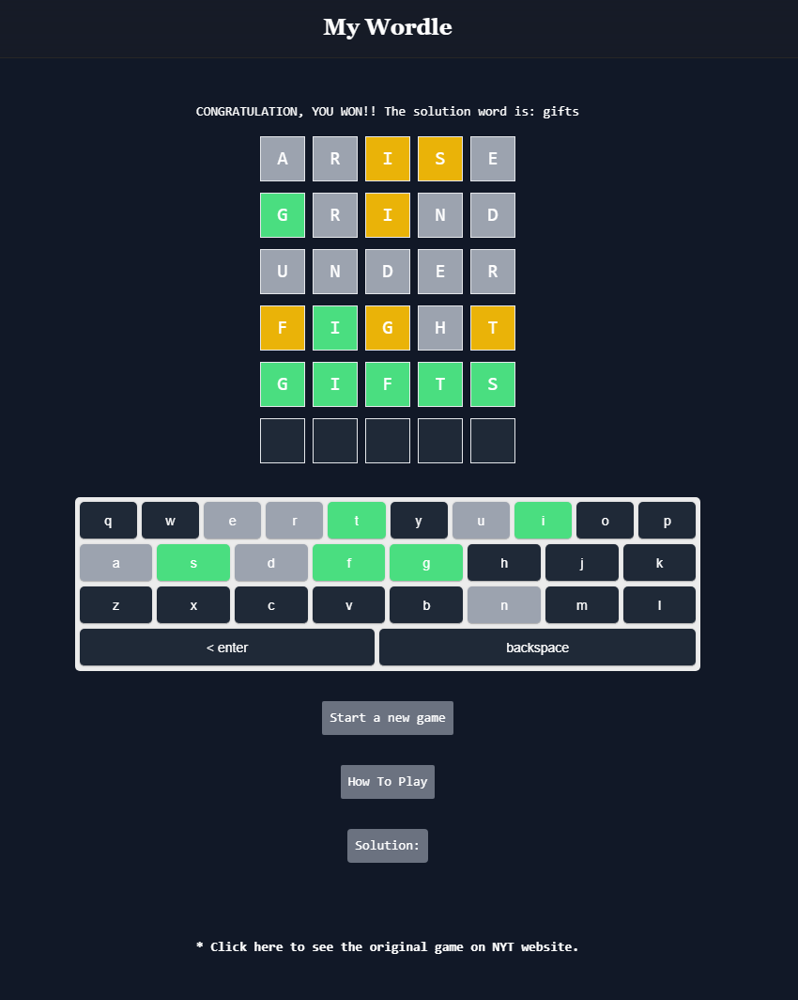

<!-- TABLE OF CONTENTS -->
<details>
  <summary>Table of Contents</summary>
  <ol>
    <li><a href="#about-the-project">About The Project</a></li>
    <li><a href="#play-the-game">Play the Game</a></li>
    <li><a href="#built-with">Built With</a></li>
      <li><a href="#getting-started">Getting Started</a></li>
        <li><a href="#learn-more">Learn More</a></li>
  </ol>
</details>

## About The Project

This repository contains source code of <a href="https://nextjs-wordle-new-york-times-game.vercel.app/" targt="_blank"> 'My Wordle' <a> (- an imitation of <a
          href="https://www.nytimes.com/games/wordle/index.html"
          target="_blank"> Wordle </a>, a popular guessing game):
<br/>
<br/>



## Play the Game

'My Wordle' deployed on Vercel <a href="https://nextjs-wordle-new-york-times-game.vercel.app/" targt="_blank"> here <a>

## Built With

- HTML,
- Tailwind CSS,
- Next.js,
- TypeScript.

## Getting Started

First, run the development server:

```bash
npm run dev
# or
yarn dev
# or
pnpm dev
```

Open [http://localhost:3000](http://localhost:3000) with your browser to see the result.

You can start editing the page by modifying `pages/index.tsx`. The page auto-updates as you edit the file.

[API routes](https://nextjs.org/docs/api-routes/introduction) can be accessed on [http://localhost:3000/api/hello](http://localhost:3000/api/hello). This endpoint can be edited in `pages/api/hello.ts`.

The `pages/api` directory is mapped to `/api/*`. Files in this directory are treated as [API routes](https://nextjs.org/docs/api-routes/introduction) instead of React pages.

This project uses [`next/font`](https://nextjs.org/docs/basic-features/font-optimization) to automatically optimize and load Inter, a custom Google Font.

## Learn More

To learn more about Next.js, take a look at the following resources:

- [Next.js Documentation](https://nextjs.org/docs) - learn about Next.js features and API.
- [Learn Next.js](https://nextjs.org/learn) - an interactive Next.js tutorial.

You can check out [the Next.js GitHub repository](https://github.com/vercel/next.js/) - your feedback and contributions are welcome!

